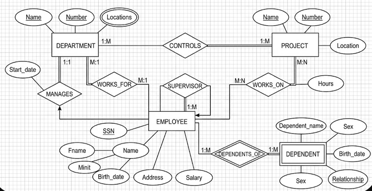

## ejercicio 1.
un hospital registra informacion de sus pacinete:
> De cada paciente se almacena:
- numero de paciente que lo identifica
- nombre
- fecha de nacimiento

> De cada expendiente medico se alamcena
- numero de expediente
- fecha de apertura 
- tipo de sangre

> Reglas del negocio
1. cada paciente debe tener exactamente un expediente medico
2. cada expediente medico pertenece a un unico paciente
3. no puede existor un expendiente sin paciente
4. no puede existir un paciente sin expediente 

> Que se debe realizar:

- identificar las entidades
- identificar atributos
- dibujar las relaciones
- determinar la cardinalidad
- determinar la participacion de cada entidad

## ejercicio 2.
un universidad administra profesores y cursos

> De cada profesor se almacena:

- Numero de profesor
- Nombre
- Especialidad

> De cada **Curos** se almacena:

-Numero de curso
-Nombre del curso
-Creditos 

> Reglas de negocio
1. Un profesor puede impartir varios cursos
2. un curso solamente puede ser impartido por un profesor
3. puede existir un profesor que actualmente no imparta cursos
4. Todo curso debe estar asignado a un profesor

## ejercicio 3
Una escuela administra alumnos y materias 

> De cada **Alumno** se almacena:

-matricula
-nombre
-semetre

> De cada **MAteria** se almacena:

-clave de la materia
-nombre de la materia
-creditos

> reglas del negocio
1. un alumon puede inscribirse en varias materias
2. una material puede tener muchos alumnos inscritos
3. puede existir una materia sin alumno inscrito
4. todo alumno debe esta inscrito en al menos una materia
5. de cada inscripcion se desea almacenar:
- fecha de inscripcion
- caliicacion final
Nota: a la relacion nombrarla **Inscribe**

## ejercicio 4 

uan empresa dedicad a las ventas al por mayor necesita regristra los siguiente:

>para los clientes:

-numero de cliente
-nombre (el cual es una persona moral)

>pedidos
-numeros de pedido
fecha de pedido

>producto

-numero de producto
-nombre
-precio

>Reglas del negocio

1. un cliente puede realizar muchos pedidos
2. cada pedido pertenece a un solo cliente
3. un pedido contiene varios productos 
4. un productos puede aparece en muchos pedidos
5. un pedido debe contener al menos un producto
6. un producto no puede no haber sido vendido
7. el detalle del pedido no existe sin pedido
8. el detalle del pedido no existe sin producto
9. el detalle almacena la cantidad vendida y el precio de venta49

## ejercicio5
1. The company is organized into departments. Each department has a unique name, a 
unique number, and a particular employee who manages the department.We keep track 
of the start date when that employee began managing the department. A department 
may have several locations. 
2. A department controls a number of projects, each of which has a unique name, a unique 
number, and a single location. 
3. We store each employee's name, Social Security number, address, salary, sex (gender), 
and birth date. An employee is assigned to one department, but may work on several 
projects, which are not necessarily controlled by the same department. We keep track of 
the current number of hours per week that an employee works on each project. We also 
keep track of the direct supervisor of each employee (who is another employee). 
4. We want to keep track of the dependents of each employee for insurance purposes.We 
keep each dependent's first name, sex, birth date, and relationship to the employee. 
 

