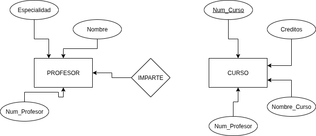
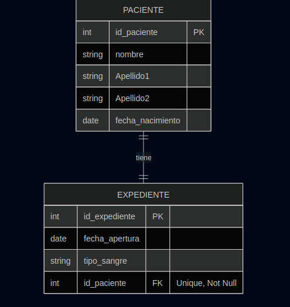
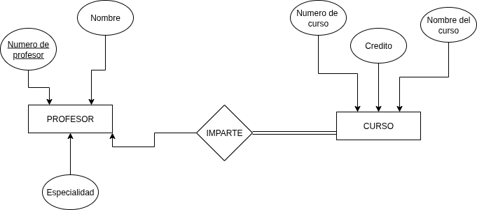
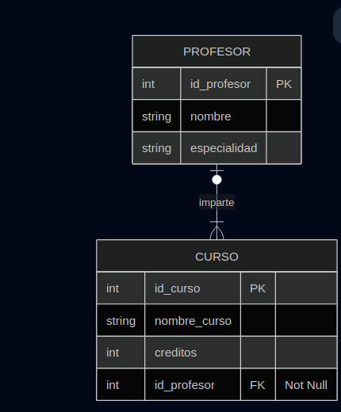
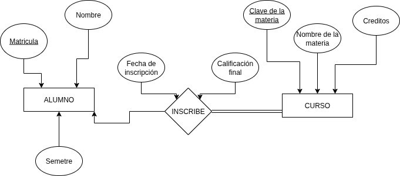
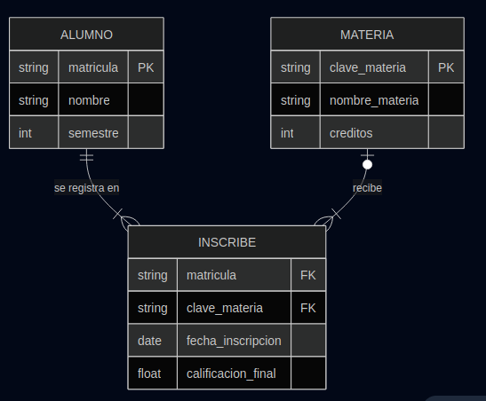
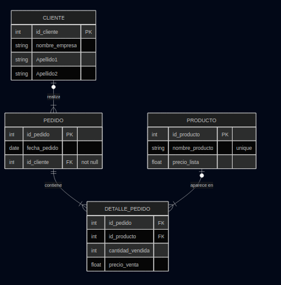
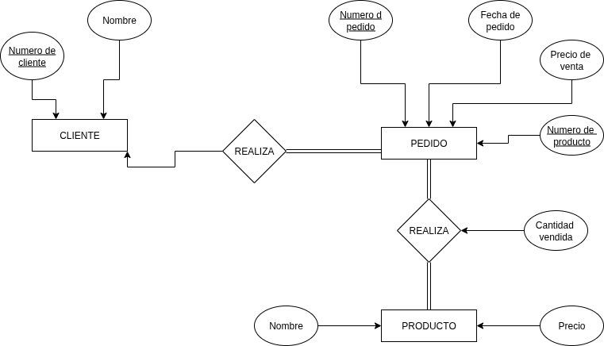
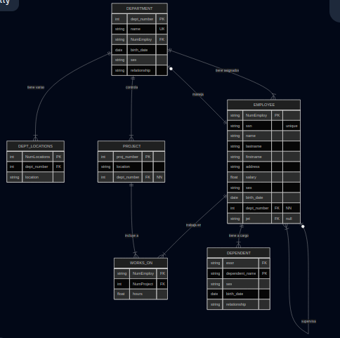
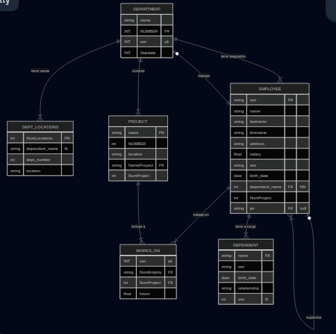

# Ejercicios de mapeo del modelo E-R a Relacional

## Ejercicios 1

### Modelo E-R

### Modelo relacional

## Ejercicios 2

### Modelo E-R

### Modelo relacional

## Ejercicios 3

### Modelo E-R

### Modelo relacional

## Ejercicios 4

### Modelo E-R

### Modelo relacional

## Ejercicios 4

### Modelo E-R

### Modelo relacional

## Ejercicios 5

### Modelo E-R

### Modelo relacional

### Modelo relacional Segundo modo
